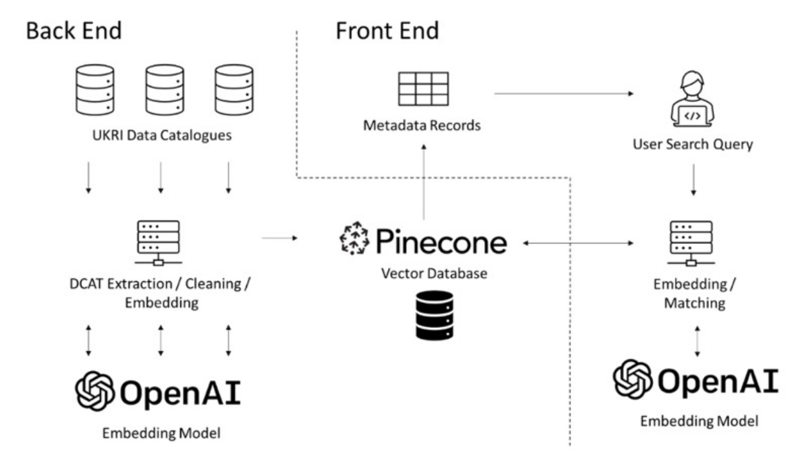
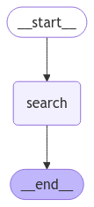
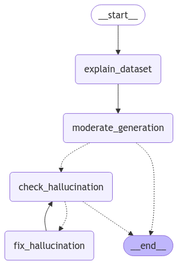

<div align="center">


  


---
**The _Semantic Catalogue_ is a project designed to enhance the search capabilities of data catalogues for research purposes. By moving beyond traditional keyword-based searches, it provides users with more accurate and relevant results through semantic understanding.**

---

[Methodology](./docs/methods/methods.md) · [View Demo](https://apps.cdrc.ac.uk/semantic-catalogue) · [Getting Started](https://github.com/cjber/semantic-catalogue?tab=readme-ov-file#getting-started)
</div>

## Features

- **Semantic Search:** Leverages OpenAI embeddings in Pinecone for context-aware dataset discovery
- **Retrieval Augmented Generation (RAG):** Generates explanations with inline citations using GPT 4o-mini
- **Content Quality Assurance:** Built-in moderation and hallucination detection
- **Automated Data Pipeline:** Dagster-managed continuous updates to the vector database

## System Architecture

The system uses Retrieval Augmented Generation (RAG) with two core components:

1. **Retrieval:** Finds relevant datasets using semantic similarity
2. **Generation:** Explains dataset relevance using retrieved information


*System Architecture*

Key components:

- **Backend:** FastAPI & LangGraph for structured processing and API integration
- **Data Pipeline:** Dagster for automated data lifecycle management
- **Vector Database:** Pinecone for efficient semantic search operations
- **AI Models:** OpenAI for semantic understanding and generation

## Detailed Functionality

### Data Management

Dagster automates the entire data pipeline - from ingestion to indexing - ensuring the Pinecone database stays current with new datasets.



### Search & Generation

1. **Semantic Search:** Queries are converted to embeddings and matched against Pinecone's vector database
2. **RAG Pipeline:** Retrieved datasets are used to generate context-aware explanations
3. **Quality Control:** Moderation and hallucination detection ensure reliable outputs





### FastAPI Endpoints

FastAPI is used to create a RESTful API allowing for the RAG graphs to interact with external services. The following endpoints are provided:

* **POST Query (`/query`)**: Accepts a search query and returns relevant documents alongside a unique thread ID associated with the query using the LangGraph `search_graph`.
* **GET Explain (`/explain/{thread_id}`)**: Accepts a `thread_id` and `docid` to provide an explanation using the LangGraph `generation_graph`.

### Containerisation

The entire project is containerised using Docker or Podman compose (tested with Podman). The `compose.yml` file gives more detail.

## Getting Started

### Prerequisites

Ensure you have the following installed:

- Python >=3.12,<3.13
- Docker or Podman
- Git

### Contribution Setup

To contribute, please follow these steps:

1. **Clone the repository:**

   ```bash
   git clone https://github.com/cjber/semantic-catalogue.git
   ```

2. **Navigate to the project directory:**

   ```bash
   cd semantic-catalogue
   ```

3. **Install dependencies:**

    This project uses `uv`:

    ```bash
    uv sync
    ```

    Alternatively, `pip` can also be used to install from a `pyproject.yaml`:

    ```bash
    pip install . # ensure you are using a venv
    ```

4. **Configure the system:**

   Edit the `config/config.toml` file to customise model settings.

## Running the Project

> [!WARNING]
> This project is not intended for public use and requires access to a private database.

The project is fully containerised using `podman`/`docker` `compose`. To run the full system, execute:

```bash
podman compose up -d
```

### Accessing the Frontend

Once up and running, access the semantic catalogue search at `http://localhost:8001`.

### Running the Dagster Pipeline

The Dagster UI is available at `http://localhost:3000`. Adjust the Auto Materialise and Sensor settings to start the automation.

### Alternative Methods

All scripts run independently, for debugging purposes. For example, to run the full LangGraph pipeline.

```
python -m semantic_catalogue.model.main
```

This submits a test query and print the outputs. Chains also provide outputs for testing:


```bash
python -m semantic_catalogue.model.chains.hallucination
```

This prints the output of a test generation that has hallucinations.


You can also start the API server independently:

```bash
fastapi dev semantic_catalogue/search_api/api.py
```
