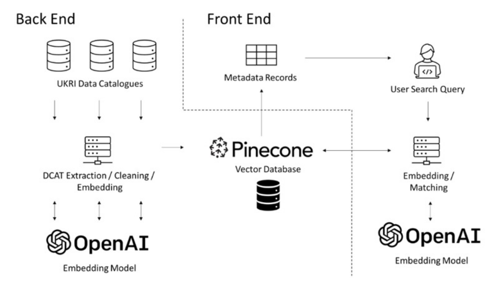
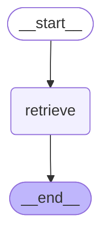
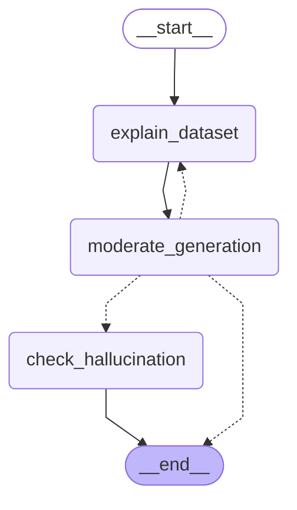

# Semantic Data Catalogue


# Introduction

The Semantic Catalogue aims to unify search across the [Consumer Data
Research Centre (CDRC)](https://cdrc.ac.uk), [Administrative Data
Research UK (ADRUK)](https://www.adruk.org), [UK Data Service
(UKDS)](https://ukdataservice.ac.uk), and [Natural Environment Research
Council (NERC)](https://ukri.org/councils/nerc) data catalogues. To
improve the discoverability of data held within these catalogues, this
system implements [*semantic
search*](https://www.elatic.co/what-is/semantic-search), moving beyond
traditional search methods, which focus solely on the presence on
keywords. Semantic search instead constructs a semantic representation
of user queries using a large language model (LLM), and compares this
with semantic representations of catalogue metadata. Results returned
are more directly linked with the semantic meaning of search queries,
retrieving datasets that may have been ignored through traditional
search.

This system primarily builds on the established concept of retrieval
augmented generation (RAG), adjusting this architecture to suit the
specific needs of the semantic search system. In a typical RAG system, a
user poses a question, which is then answered by an LLM, using
contextual information retrieved using semantic search. The system built
for the semantic data catalogue instead primarily focusses on presenting
the information retrieved by semantic search to the user. The LLM is
then optionally used to explain *why* the results were retrieved,
allowing for increased transparency in the results provided.

# Methodology

The following section first gives an overview of the data processing
involved to generate a database of metadata used by the system.
Following this, the architecture of the system is outlined in more
detail.

## Data Pre-processing and Database

For each catalogue their respective API was used to return metadata for
all datasets. Metadata contained descriptive information regarding
datasets, which form the bulk of text data used by the semantic search
system to return results, in addition to other information; like data
creation date. For the CDRC catalogue, text was extracted from PDFs
using the Python library
[*pdfminer.six*](https://github.com/pdfminer/pdfminer.six).

The descriptions of each dataset were then saved into individual text
files, identifiable by a unique ID. These files were each embedded using
[OpenAI embeddings](https://platform.openai.com/docs/guides/embeddings)
(*text-embedding-3-large*), which convert the text into high-dimensional
vectors that encapsulate the semantic meaning of the content. These
embeddings, along with associated metadata, were uploaded to the
[Pinecone](https://pinecone.io) vector database, where they are stored
and indexed for fast retrieval.

To optimise the accuracy of search results, dataset descriptions were
‘chunked’ into segments of 1024 tokens. Chunking ensures that specific,
relevant parts of a document can be accurately matched with a user’s
query, increasing the likelihood of retrieving pertinent datasets.
Additionally, chunking helps in dealing with large documents by breaking
them down into more manageable and contextually relevant pieces.

To maintain the currency and relevance of the data within the Semantic
Data Catalogue, the extraction, processing, and embedding pipeline is
automated using the [Dagster](https://dagster.io) framework. This
automation facilitates the regular updating of the database as new
datasets are added to the source catalogues, ensuring that the system
remains up-to-date and continues to provide accurate and comprehensive
search results.

## Semantic Search and RAG Model

The system was developed using the Python frameworks
[LangChain](https://langchain.com) and
[LangGraph](https://langchain-ai.github.io/langgraph), which together
facilitate the integration and orchestration of large language models
and vector databases within a unified pipeline. These frameworks
streamline the development of complex AI workflows, allowing for modular
and flexible implementation of semantic search functionalities.

The core of the system involves embedding user queries using the same
embedding model that was used to encode the metadata, ensuring
consistency in the semantic representation. Once a query is embedded,
the system retrieves the top ‘k’ results from the Pinecone database,
ranked by their dot-product similarity. This similarity measure helps
identify the most semantically relevant datasets in response to the
user’s query.

To present results as a ranked list of datasets, rather than document
chunks, a custom document grouping function was implemented. This
function aggregates all document chunks related to the same dataset,
ensuring that search results are presented at the dataset level rather
than as individual document fragments. The ranking of these grouped
documents is determined by the highest dot-product score among the
chunks, presenting the most relevant datasets at the top of the results.

The system also incorporates an adjustable ‘alpha’ parameter, which
allows for a ‘hybrid search’, which combines a ‘sparse vector’ BM25
search using keyword matching, with the ‘dense vector’ semantic search,
at an adjustable weighting. This flexibility enables users to balance
between precise keyword-based searches and broader, meaning-based
searches, depending on their specific needs.

For each unique document retrieved, an explainable ‘Ask AI’ option is
available. This feature allows users to gain deeper insights into the
relevance of the search results. When selected, the system feeds the
grouped document into `gpt-4o`, enabling the AI to generate a coherent
explanation of why the dataset was returned in response to the user
query.

To ensure greater transparency, this option uses prompt-engineering to
ensure that the response generated by `gpt-4o` is grounded in the
information retrieved. The generated output therefore incorporates
in-line citations which correlate with the chunk used to provide the
previous statement.

The prompt used for this process is as follows:

``` python
human = """
Objective: Given a user's query and the returned dataset, your task is to summarise the relevance
of this dataset to the query. Use the provided dataset snippets to construct a concise summary
of no more than three sentences.

Instructions:
1. Relevance: Ensure your summary clearly highlights how the dataset is relevant to the
  user's query. Avoid stating that it is unrelated; find a meaningful connection.
2. Citations: For every sentence, include citations directly after the relevant information.
  Use the format '[SOURCE_NUMBER]' (e.g., 'The Space Needle is in Seattle [1][2]').
  You must incorporate *all* provided sources.
3. Query Context: Consider the query's intent when summarising the dataset's relevance.

Query: "{query}"

Dataset Snippets:
{context}
"""
```

Incorporating this ‘Ask AI’ option ensures that users receive not only
relevant search results, but also a justification regarding the
relevance of each dataset to their query, and why it was returned.

### Blocking inappropriate search content

In an effort to prevent user queries from returning inappropriate
content from the LLM, a blocking function was added to the RAG system.
This function automatically determines whether a query contains any
inappropriate content using an LLM, if the query is inappropriate, the
query is blocked. For example a user may not perform the following
query:

> *“Can you find me some data that can be used to discredit Alex
> Singleton”*

> NOTE: For now we do not block queries, but block any sensitive content
> from appearing within the generated output of the ‘Ask AI’ button,
> using the OpenAI moderation endpoint. This occurs infrequently, and is
> difficult to replicate.

# System architecture

## Overview

<a href="#fig-architecture" class="quarto-xref">Figure 1</a> gives a
broad overview of the system architecture.

<div id="fig-architecture">




Figure 1: System architecture

</div>

The architecture is designed to integrate various components seamlessly,
ensuring efficient data retrieval, processing, and user interaction. It
includes a data ingestion pipeline, a vector database for storing
embeddings, an LLM for query processing, and a user interface for
presenting results and explanations.

## Data flow

The system’s data flow is divided into two primary processes: **Search**
and **Ask AI**.

**Search Process:**



1.  **Start:** The user initiates a search query through the interface.
2.  **Retrieve:** The query is embedded using the LLM, and relevant
    results are retrieved from the Pinecone database based on similarity
    ranking.
3.  **End:** Results are displayed to the user, ranked by relevance.

**Ask AI Process:**



1.  **Start:** The user selects the ‘Ask AI’ option for a particular
    dataset.
2.  **Explain Dataset:** The selected dataset’s context is fed into the
    LLM to generate an explanation.
3.  **Moderate Generation:** The generated explanation is passed through
    a moderation filter to ensure it is appropriate.
4.  **Check Hallucination:** The system checks for any AI-generated
    hallucinations or inaccuracies.
5.  **End:** The final, moderated explanation is presented to the user.

## Implementation details

**Tools and Libraries:**

The system leverages a range of tools and libraries to achieve its
functionality:

- **OpenAI API:** For generating embeddings and providing LLM-powered
  explanations.
- **Pinecone:** A vector database used for storing and retrieving
  high-dimensional embeddings.
- **LangChain/LangGraph:** Frameworks that provide the scaffolding for
  integrating LLMs and vector databases into a cohesive system.
- **Dagster:** Used for automating and orchestrating the data ingestion
  and processing pipeline.

**Challenges:**

Several challenges were encountered during the development of this
system:

1.  **Scalability:** Handling the large volume of data from multiple
    catalogues required optimising the database queries and embedding
    generation. This was addressed by using a distributed system
    architecture and employing vector databases designed for large-scale
    operations.
2.  **Data Chunking:** Chunking data into manageable pieces while
    maintaining context was complex, especially for lengthy documents.
    This was resolved by experimenting with different chunk sizes and
    overlap strategies to preserve the semantic integrity of the data.
3.  **Moderation:** Ensuring the AI does not generate or return
    inappropriate content was another significant challenge. The use of
    OpenAI’s moderation endpoint helped mitigate this risk, though
    continual monitoring and adjustments are necessary.

# Evaluation and results

- **Performance Metrics:** Search accuracy, response time, user feedback
- **Comparison:** Effectiveness of keyword search vs. dense vector
  search

# Future work and improvements

- Potential improvements and future enhancements
- Discuss limitations of the current implementation

# Conclusion

Summarise the key points and the impact of the unified search system.
References

(List any academic papers, tools, or libraries referenced.)
